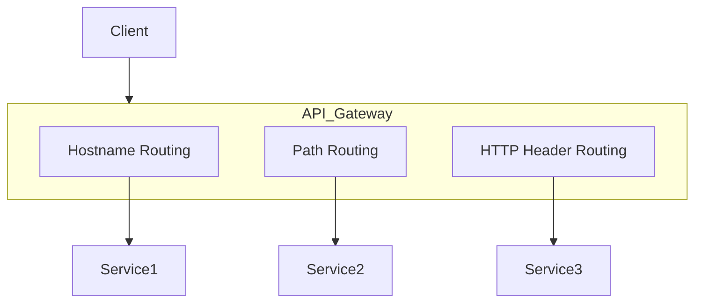
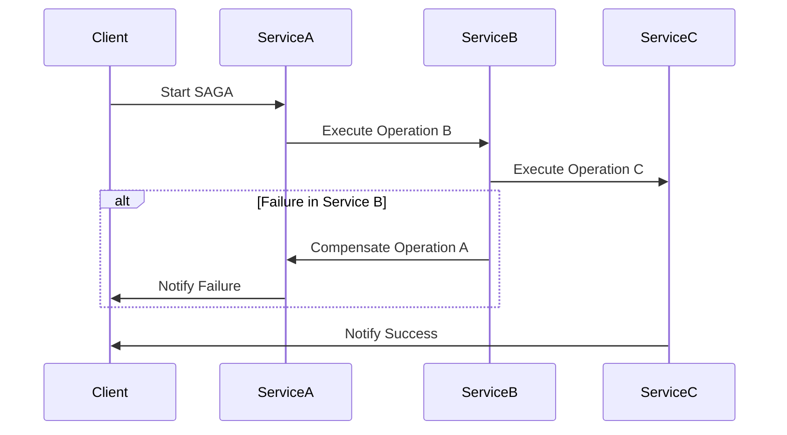
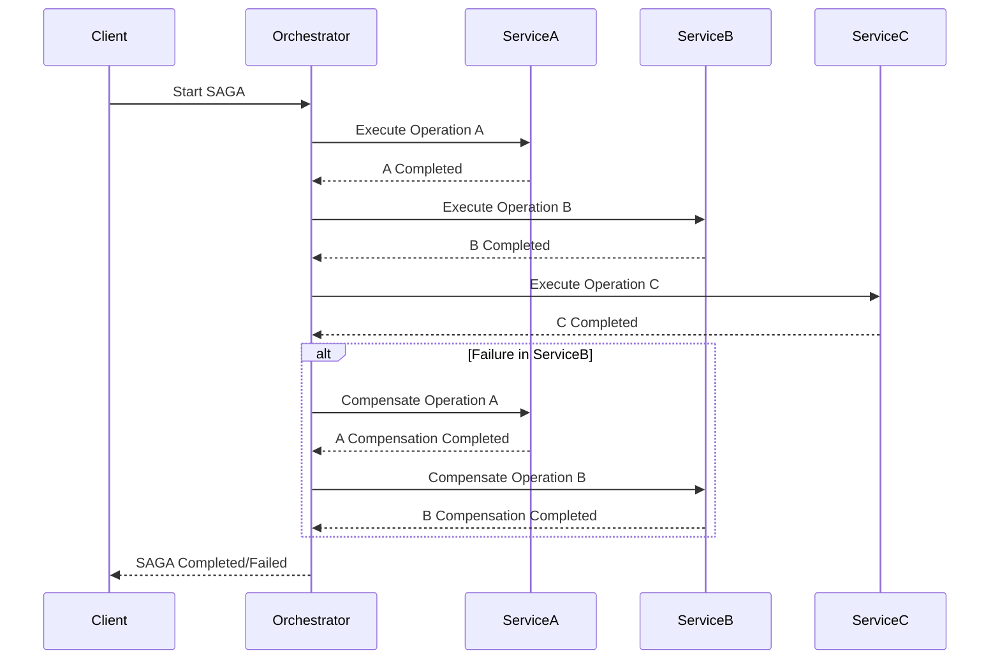
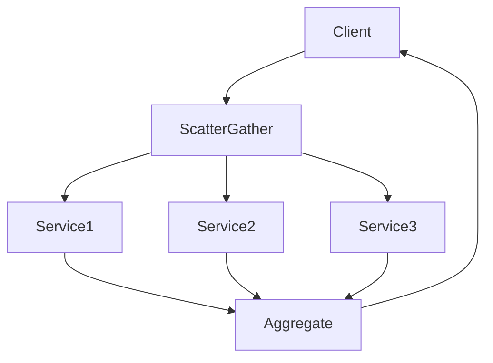
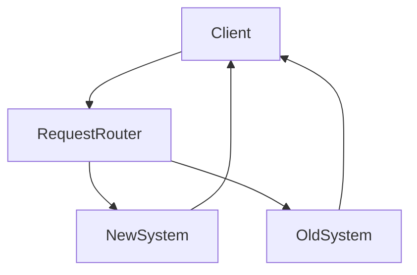
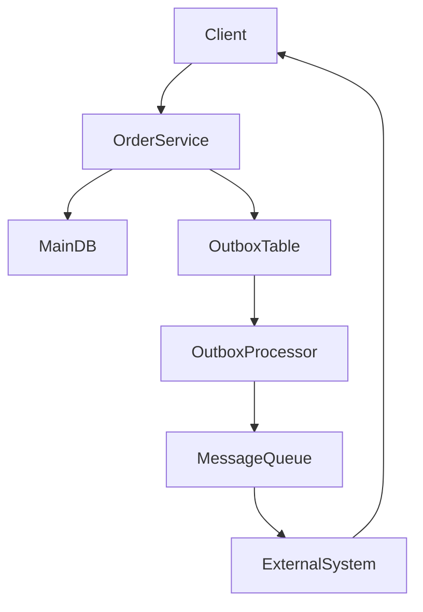

Certainly! Here’s a detailed explanation of each microservice design pattern, along with code examples and Mermaid diagrams where applicable.

### **1. Anti-Corruption Layer (ACL) Pattern**

#### **Explanation:**
The Anti-Corruption Layer (ACL) pattern is used to integrate a new system with an existing system while protecting the new system from the existing system’s design and data models. It acts as a translator that translates the data and operations from one system to another, ensuring that the new system is not contaminated by the old system's potentially flawed design.

#### **Code Example:**
Imagine integrating a legacy billing system with a new order management system.

**Legacy Billing System:**
```java
public class LegacyBillingSystem {
    public void processOldOrder(String oldOrderFormat) {
        // Legacy processing logic
    }
}
```

**New Order Management System:**
```java
public class OrderService {
    private final LegacyBillingAdapter legacyBillingAdapter;

    public OrderService(LegacyBillingAdapter adapter) {
        this.legacyBillingAdapter = adapter;
    }

    public void processOrder(Order order) {
        String oldOrderFormat = legacyBillingAdapter.convertToOldFormat(order);
        legacyBillingAdapter.processOldOrder(oldOrderFormat);
    }
}
```

**Anti-Corruption Layer:**
```java
public class LegacyBillingAdapter {
    private final LegacyBillingSystem legacySystem;

    public LegacyBillingAdapter(LegacyBillingSystem system) {
        this.legacySystem = system;
    }

    public String convertToOldFormat(Order order) {
        // Conversion logic
        return "convertedOrder";
    }

    public void processOldOrder(String oldOrderFormat) {
        legacySystem.processOldOrder(oldOrderFormat);
    }
}
```

#### **Mermaid Diagram:**
```mermaid
graph TD
    NewOrderManagementSystem --> ACL
    ACL --> LegacyBillingSystem

    subgraph New System
        NewOrderManagementSystem
    end

    subgraph ACL
        ACL
    end

    subgraph Legacy System
        LegacyBillingSystem
    end
```

### **2. API Routing Patterns**

#### **Explanation:**
API routing patterns determine how an API gateway or server routes incoming requests to the appropriate microservice. Common routing patterns include:

- **Hostname Routing**
- **Path Routing**
- **HTTP Header Routing**

#### **Code Example:**

**Hostname Routing Example:**
In an Nginx configuration:
```nginx
server {
    listen 80;
    server_name service1.example.com;
    location / {
        proxy_pass http://service1_backend;
    }
}

server {
    listen 80;
    server_name service2.example.com;
    location / {
        proxy_pass http://service2_backend;
    }
}
```

**Path Routing Example:**
In an Nginx configuration:
```nginx
server {
    listen 80;
    location /service1/ {
        proxy_pass http://service1_backend/;
    }

    location /service2/ {
        proxy_pass http://service2_backend/;
    }
}
```

**HTTP Header Routing Example:**
In an Nginx configuration:
```nginx
server {
    listen 80;

    location / {
        if ($http_x_service = "service1") {
            proxy_pass http://service1_backend;
        }

        if ($http_x_service = "service2") {
            proxy_pass http://service2_backend;
        }
    }
}
```

#### **Mermaid Diagram:**


### **3. Circuit Breaker Pattern**

#### **Explanation:**
The Circuit Breaker pattern is used to handle failures in a distributed system by preventing a failure in one service from causing failures in other services. It monitors for failures and allows a service to recover before allowing new requests.

#### **Code Example:**
Using a popular circuit breaker library like Hystrix in Java:

```java
import com.netflix.hystrix.HystrixCommand;
import com.netflix.hystrix.HystrixCommandGroupKey;

public class ExampleCommand extends HystrixCommand<String> {
    protected ExampleCommand() {
        super(HystrixCommandGroupKey.Factory.asKey("ExampleGroup"));
    }

    @Override
    protected String run() throws Exception {
        // Actual service call
        return "Service Response";
    }

    @Override
    protected String getFallback() {
        return "Fallback Response";
    }
}
```

#### **Mermaid Diagram:**
```mermaid
graph TD
    Client --> CircuitBreaker
    CircuitBreaker --> Microservice
    CircuitBreaker --> Fallback

    subgraph CircuitBreaker
        CircuitBreaker
    end

    subgraph Microservice
        Microservice
    end

    subgraph Fallback
        Fallback
    end
```

### **4. Event Sourcing Pattern**

#### **Explanation:**
Event Sourcing involves storing the state of a system as a sequence of events rather than as a snapshot of the state. Each change to the state is recorded as an event, and the current state is derived by replaying these events.

#### **Code Example:**
Java pseudo-code for event sourcing:
```java
public class Order {
    private List<Event> events = new ArrayList<>();

    public void apply(Event event) {
        // Apply the event to the current state
        events.add(event);
    }

    public void replayEvents() {
        for (Event event : events) {
            // Replay each event
        }
    }
}
```

#### **Mermaid Diagram:**
```mermaid
graph TD
    Client --> EventStore
    EventStore --> Event
    Event --> Aggregate

    subgraph EventStore
        EventStore
    end

    subgraph Aggregate
        Aggregate
    end

    Aggregate --> State
    State --> Client
```

### **5. Hexagonal Architecture (Ports and Adapters)**

#### **Explanation:**
Hexagonal Architecture, or Ports and Adapters, promotes a separation of concerns by isolating the core business logic from external systems. It defines interfaces (ports) for interactions and uses adapters to connect to these interfaces.

#### **Code Example:**
Java pseudo-code for hexagonal architecture:

**Core Business Logic:**
```java
public interface OrderService {
    void placeOrder(Order order);
}

public class OrderServiceImpl implements OrderService {
    @Override
    public void placeOrder(Order order) {
        // Core logic
    }
}
```

**Adapter:**
```java
public class OrderController {
    private final OrderService orderService;

    public OrderController(OrderService orderService) {
        this.orderService = orderService;
    }

    public void placeOrder(Order order) {
        orderService.placeOrder(order);
    }
}
```

#### **Mermaid Diagram:**
```mermaid
graph TD
    Client --> Adapter
    Adapter --> Ports
    Ports --> CoreBusinessLogic
    CoreBusinessLogic --> State

    subgraph Adapter
        Adapter
    end

    subgraph Ports
        Ports
    end

    subgraph CoreBusinessLogic
        CoreBusinessLogic
    end

    subgraph State
        State
    end
```

### **6. Publish-Subscribe Pattern**

#### **Explanation:**
The Publish-Subscribe pattern allows a service (the publisher) to send messages to a message broker, which then distributes these messages to interested subscribers.

#### **Code Example:**
Using a message broker like RabbitMQ:

**Publisher:**
```java
import com.rabbitmq.client.*;

public class Publisher {
    private final static String QUEUE_NAME = "queue";

    public static void main(String[] argv) throws Exception {
        ConnectionFactory factory = new ConnectionFactory();
        factory.setHost("localhost");
        try (Connection connection = factory.newConnection(); 
             Channel channel = connection.createChannel()) {
            channel.queueDeclare(QUEUE_NAME, false, false, false, null);
            String message = "Hello World!";
            channel.basicPublish("", QUEUE_NAME, null, message.getBytes());
        }
    }
}
```

**Subscriber:**
```java
import com.rabbitmq.client.*;

public class Subscriber {
    private final static String QUEUE_NAME = "queue";

    public static void main(String[] argv) throws Exception {
        ConnectionFactory factory = new ConnectionFactory();
        factory.setHost("localhost");
        try (Connection connection = factory.newConnection(); 
             Channel channel = connection.createChannel()) {
            channel.queueDeclare(QUEUE_NAME, false, false, false, null);
            DeliverCallback deliverCallback = (consumerTag, delivery) -> {
                String message = new String(delivery.getBody(), "UTF-8");
                System.out.println("Received '" + message + "'");
            };
            channel.basicConsume(QUEUE_NAME, true, deliverCallback, consumerTag -> { });
        }
    }
}
```

#### **Mermaid Diagram:**
```mermaid
graph TD
    Publisher --> MessageBroker
    MessageBroker --> Subscriber1
    MessageBroker --> Subscriber2

    subgraph Publisher
        Publisher
    end

    subgraph MessageBroker
        MessageBroker
    end

    subgraph Subscribers
        Subscriber1
        Subscriber2
    end
```

### **7. Retry with Backoff Pattern**

#### **Explanation:**
The Retry with Backoff pattern is used to handle transient failures by retrying an operation after a delay, which increases progressively with each retry attempt.

#### **Code Example:**
Java pseudo-code with exponential backoff:

```java
public class RetryWithBackoff {
    public void executeWithRetry(Runnable operation) {
        int maxRetries = 5;
        int attempt = 0;

        while (

attempt < maxRetries) {
            try {
                operation.run();
                break;
            } catch (Exception e) {
                attempt++;
                try {
                    Thread.sleep((long) Math.pow(2, attempt) * 1000); // Exponential backoff
                } catch (InterruptedException ie) {
                    Thread.currentThread().interrupt();
                }
            }
        }
    }
}
```

#### **Mermaid Diagram:**
```mermaid
graph TD
    Client --> RetryLogic
    RetryLogic --> Service
    Service --> Success
    RetryLogic --> Retry
    Retry --> Backoff
    Backoff --> RetryLogic
    RetryLogic --> Failure

    subgraph RetryLogic
        RetryLogic
    end

    subgraph Service
        Service
    end

    subgraph Backoff
        Backoff
    end

    subgraph Success
        Success
    end

    subgraph Failure
        Failure
    end
```

### **8. Saga Patterns**

#### **8.1 Saga Choreography**

**Explanation:**
In Saga Choreography, each service in the saga is responsible for managing its own transactions and compensations, and communicates directly with other services to proceed with the saga.

**Mermaid Diagram:**


#### **8.2 Saga Orchestration**

**Explanation:**
In Saga Orchestration, a central orchestrator manages the entire saga process, invoking services and handling compensations.

**Mermaid Diagram:**


### **9. Scatter-Gather Pattern**

#### **Explanation:**
The Scatter-Gather pattern involves sending a request to multiple services (scatter) and aggregating their responses (gather). It’s useful for parallel processing and collecting results.

#### **Code Example:**
Java pseudo-code using CompletableFuture:

```java
import java.util.concurrent.CompletableFuture;
import java.util.concurrent.ExecutionException;

public class ScatterGather {
    public static void main(String[] args) throws ExecutionException, InterruptedException {
        CompletableFuture<String> future1 = CompletableFuture.supplyAsync(() -> serviceCall("Service1"));
        CompletableFuture<String> future2 = CompletableFuture.supplyAsync(() -> serviceCall("Service2"));
        CompletableFuture<String> future3 = CompletableFuture.supplyAsync(() -> serviceCall("Service3"));

        CompletableFuture.allOf(future1, future2, future3).join();

        String result1 = future1.get();
        String result2 = future2.get();
        String result3 = future3.get();

        // Aggregate results
    }

    private static String serviceCall(String serviceName) {
        return "Response from " + serviceName;
    }
}
```

#### **Mermaid Diagram:**


### **10. Strangler Fig Pattern**

#### **Explanation:**
The Strangler Fig pattern involves incrementally replacing an old system with a new system by routing requests to the new system while still supporting the old system. Over time, the old system is gradually phased out.

#### **Code Example:**
Using a proxy pattern to route requests:

```java
public class RequestRouter {
    private final OldSystem oldSystem;
    private final NewSystem newSystem;

    public RequestRouter(OldSystem oldSystem, NewSystem newSystem) {
        this.oldSystem = oldSystem;
        this.newSystem = newSystem;
    }

    public void routeRequest(Request request) {
        if (shouldRouteToNewSystem(request)) {
            newSystem.handleRequest(request);
        } else {
            oldSystem.handleRequest(request);
        }
    }

    private boolean shouldRouteToNewSystem(Request request) {
        // Routing logic
        return true;
    }
}
```

#### **Mermaid Diagram:**


### **11. Transactional Outbox Pattern**

#### **Explanation:**
The Transactional Outbox pattern involves using an outbox table to ensure that messages are sent reliably. Changes to the main data store and outbox table are performed in a single transaction, ensuring that messages are only sent if the primary transaction succeeds.

#### **Code Example:**
Using a database transaction:

**Service:**
```java
public class OrderService {
    private final OrderRepository orderRepository;
    private final OutboxRepository outboxRepository;

    @Transactional
    public void placeOrder(Order order) {
        orderRepository.save(order);
        outboxRepository.save(new OutboxMessage("Order placed", order.getId()));
    }
}
```

**Message Sender:**
```java
public class OutboxProcessor {
    public void processOutboxMessages() {
        List<OutboxMessage> messages = outboxRepository.findUnprocessed();
        for (OutboxMessage message : messages) {
            sendMessage(message);
            outboxRepository.markAsProcessed(message.getId());
        }
    }
}
```

#### **Mermaid Diagram:**


Each pattern and design choice in microservices architecture helps address specific challenges, such as integration, fault tolerance, and scalability. The diagrams and code examples provided illustrate how these patterns can be implemented and visualized in a microservice ecosystem.
