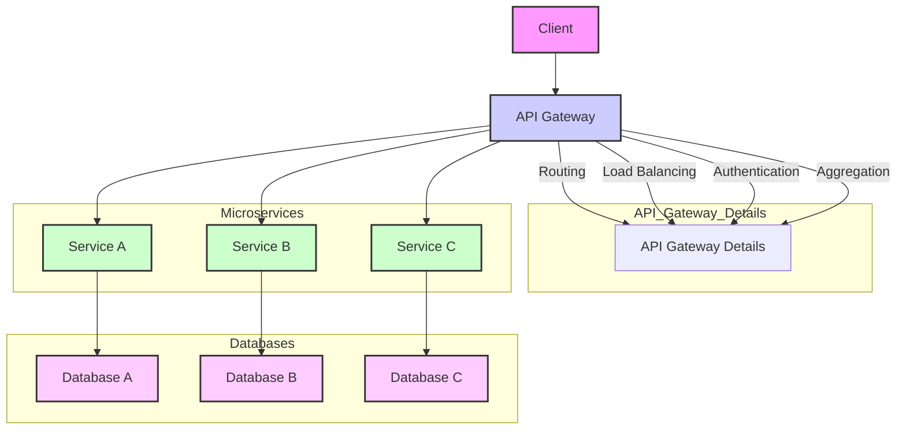
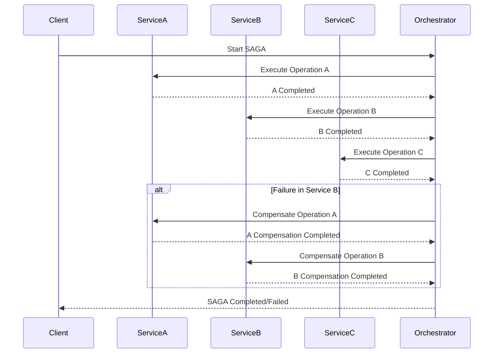
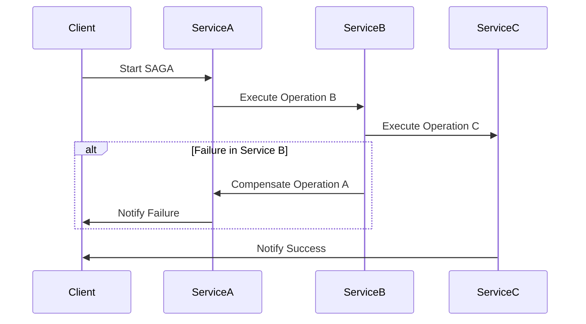
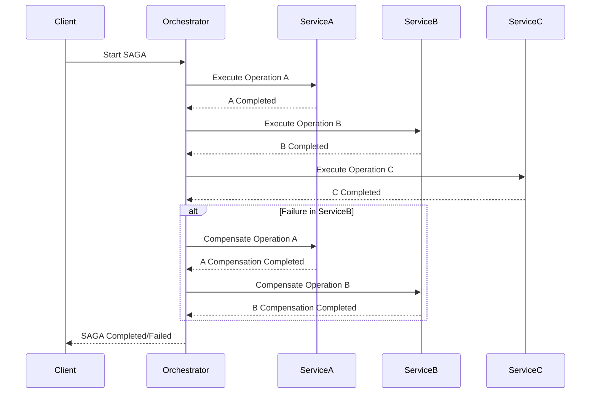

An API Gateway microservice architecture is a design pattern where a single entry point (the API Gateway) handles incoming requests and routes them to the appropriate microservices. This architecture is particularly useful for managing and coordinating multiple microservices and can help with tasks such as load balancing, security, and request routing.

Here’s a detailed explanation and a diagram of an API Gateway microservice architecture:

### **API Gateway Microservice Architecture**

#### **Components:**

1. **API Gateway**: Acts as the single entry point for all client requests. It handles routing, load balancing, authentication, and can also aggregate results from multiple microservices. 

2. **Microservices**: Independent services that handle specific business functionalities. Each microservice is responsible for its own data and logic, and they interact with each other through APIs.

3. **Service Registry**: Keeps track of all available services and their locations. It helps the API Gateway to route requests to the correct microservice instances.

4. **Client**: The entity (e.g., web application, mobile app) that sends requests to the API Gateway.

5. **Database**: Each microservice may have its own database to manage its data independently.

6. **Authentication Service**: (Optional) Handles user authentication and authorization, ensuring that requests are properly authenticated before they reach the microservices.

7. **Logging & Monitoring**: Collects logs and metrics to monitor the health and performance of the services and the API Gateway.

8. **Rate Limiting & Caching**: Optional components within the API Gateway to manage request rates and cache responses to improve performance.

#### **Diagram:**

```plaintext
            +-------------------+
            |     Client        |
            +-------------------+
                     |
                     v
            +-------------------+
            |    API Gateway    |
            +-------------------+
            | - Routing         |
            | - Load Balancing  |
            | - Authentication  |
            | - Aggregation     |
            +-------------------+
           /           |           \
          /            |            \
         v             v             v
+----------------+  +----------------+  +----------------+
|   Service A    |  |   Service B    |  |   Service C    |
|   (Microservice)|  |   (Microservice)|  |   (Microservice)|
+----------------+  +----------------+  +----------------+
| - Business Logic|  | - Business Logic|  | - Business Logic|
| - Data Access   |  | - Data Access   |  | - Data Access   |
+----------------+  +----------------+  +----------------+
         |                 |                 |
         v                 v                 v
+----------------+  +----------------+  +----------------+
|  Database A    |  |  Database B    |  |  Database C    |
+----------------+  +----------------+  +----------------+
```



#### **Description of Diagram:**

1. **Client**: Initiates requests to the API Gateway.
2. **API Gateway**: Receives requests from the client and routes them to the appropriate microservices based on the request path and method. It may also handle authentication, rate limiting, caching, and aggregation of responses from multiple services.
3. **Microservices (Service A, B, C)**: Perform specific business functions and interact with their respective databases. Each microservice is responsible for its own logic and data management.
4. **Databases**: Store data specific to each microservice. Each microservice can have its own database schema or even use different database technologies as needed.

### **Additional Considerations:**

- **Service Registry**: A tool like Eureka or Consul that helps the API Gateway locate and communicate with microservice instances.
- **Authentication Service**: Can be integrated with the API Gateway for centralized authentication or can be a separate microservice.
- **Logging & Monitoring**: Tools like ELK Stack (Elasticsearch, Logstash, Kibana) or Prometheus/Grafana for logging and monitoring.

This architecture helps in managing complexity by decoupling services, provides scalability, and allows for independent deployment and scaling of microservices.

In the context of software architecture, particularly in distributed systems and microservices, **SAGA** stands for **"SAGA"** which is a pattern used to manage long-running transactions and ensure data consistency across distributed systems. Here’s a detailed explanation:

### **SAGA Pattern**

**Definition**:
The SAGA pattern is a design pattern used to handle transactions that span multiple services or systems in a distributed environment. It ensures that a series of operations are completed successfully or, in case of failure, the system can be brought back to a consistent state through compensating actions.

### **Key Concepts**

1. **Long-Running Transactions**:
   - **Long-running transactions** are transactions that span multiple steps and can take a significant amount of time to complete, often involving multiple microservices or systems.

2. **Atomic Operations**:
   - **Atomic operations** in the context of a SAGA are individual operations that are part of a larger transaction. Each operation is performed by a different service or system.

3. **Compensating Transactions**:
   - **Compensating transactions** are operations designed to undo the changes made by previous operations in case of a failure. They are used to roll back the system to a consistent state.

4. **Choreography vs. Orchestration**:
   - **Choreography**: Each service involved in the SAGA knows about the other services and is responsible for invoking the next service in the sequence.
   - **Orchestration**: A central coordinator (often called a "saga orchestrator") manages the sequence of service calls and handles compensating transactions.

### **How It Works**

1. **Initiate a SAGA**:
   - A SAGA is initiated when a long-running transaction starts. This transaction is broken down into a series of smaller, manageable steps.

2. **Execute Transactions**:
   - Each step or operation in the SAGA is executed in sequence. These operations are typically distributed across different microservices.

3. **Handle Failures**:
   - If any operation fails, compensating transactions are triggered to reverse the changes made by previous operations, ensuring that the system remains in a consistent state.

4. **Complete the SAGA**:
   - Once all operations are successfully completed, the SAGA ends. The system can be considered consistent if all steps have been executed successfully, or it has been rolled back to its previous state in case of failures.

### **Example**

Consider an online e-commerce application where placing an order involves several steps:

1. **Reserve Inventory**: Reserve items in the warehouse.
2. **Process Payment**: Charge the customer’s credit card.
3. **Ship Items**: Arrange for the items to be shipped.

If reserving inventory is successful but processing payment fails, the system needs to undo the inventory reservation. Similarly, if shipping fails after successful payment, the payment needs to be refunded, and inventory reservation must be reversed.

### **Diagram**

Here’s a simple Mermaid diagram illustrating a SAGA pattern with orchestration:



In this diagram:
- **Client** starts the SAGA via the **Orchestrator**.
- The **Orchestrator** invokes operations in **ServiceA**, **ServiceB**, and **ServiceC**.
- If an operation fails, compensating operations are triggered to maintain consistency.

### **Benefits**

- **Consistency**: Ensures data consistency across distributed services.
- **Resilience**: Provides mechanisms to handle failures and roll back changes.
- **Scalability**: Supports scalable and independent operation of services.

### **Drawbacks**

- **Complexity**: Can introduce complexity in managing and coordinating transactions and compensations.
- **Latency**: May increase latency due to multiple operations and compensations.

The SAGA pattern is essential in distributed systems to manage complex, long-running transactions and ensure data consistency across multiple services.

Certainly! The SAGA pattern can be implemented using two primary approaches: **Choreography** and **Orchestration**. Here are diagrams for both approaches using Mermaid syntax.

### **1. SAGA Choreography**

In **Choreography**, each service involved in the SAGA knows about the next service and is responsible for calling it. There is no central coordinator; each service informs the next service in the process.



**Explanation**:
- **Client** starts the SAGA by calling **ServiceA**.
- **ServiceA** then calls **ServiceB**, and **ServiceB** calls **ServiceC**.
- If a failure occurs in **ServiceB**, it triggers compensations in **ServiceA**.
- **ServiceC** sends a success notification back to the **Client** if all operations succeed.

### **2. SAGA Orchestration**

In **Orchestration**, a central coordinator (the orchestrator) manages the SAGA process, invoking each service in the correct order and handling compensations if necessary.



**Explanation**:
- **Client** starts the SAGA through the **Orchestrator**.
- The **Orchestrator** invokes **ServiceA**, **ServiceB**, and **ServiceC** in sequence.
- If a failure occurs in **ServiceB**, the **Orchestrator** handles compensations by calling **ServiceA** and **ServiceB** to undo changes.
- The **Orchestrator** then sends a success or failure notification back to the **Client**.

### Summary

- **Choreography**: Each service in the SAGA knows the next service and manages its own transactions and compensations. It promotes loose coupling but requires services to be aware of each other.
- **Orchestration**: A central orchestrator manages the entire process, invoking services and handling compensations. It provides a single point of control but can be a single point of failure or bottleneck.

Both approaches have their use cases and can be chosen based on the specific requirements of the system and the desired level of control and complexity.

Certainly! The SOLID principles are a set of five design principles that help developers create software that is easy to manage and scale. Here’s an in-depth explanation of each SOLID principle with Java code examples.

### 1. Single Responsibility Principle (SRP)

**Principle**: A class should have only one reason to change, meaning it should only have one job or responsibility.

**Violation Example**:
```java
public class Employee {
    private String name;
    private double salary;

    public void calculateSalary() {
        // Calculate salary logic
    }

    public void generatePayrollReport() {
        // Generate payroll report logic
    }
}
```
In the above example, the `Employee` class has two responsibilities: managing employee data and generating payroll reports. This violates SRP.

**Adhering to SRP**:
```java
public class Employee {
    private String name;
    private double salary;

    public void calculateSalary() {
        // Calculate salary logic
    }
}

public class PayrollReportGenerator {
    public void generatePayrollReport(Employee employee) {
        // Generate payroll report logic
    }
}
```
Here, the `Employee` class is only responsible for salary calculations, while the `PayrollReportGenerator` handles report generation, adhering to SRP.

### 2. Open/Closed Principle (OCP)

**Principle**: Software entities should be open for extension but closed for modification. This means you should be able to add new functionality without changing existing code.

**Violation Example**:
```java
public class Shape {
    public double calculateArea() {
        // Default implementation
        return 0;
    }
}

public class AreaCalculator {
    public double calculateTotalArea(Shape[] shapes) {
        double total = 0;
        for (Shape shape : shapes) {
            if (shape instanceof Circle) {
                // Specific handling for Circle
                Circle circle = (Circle) shape;
                total += Math.PI * circle.getRadius() * circle.getRadius();
            } else if (shape instanceof Rectangle) {
                // Specific handling for Rectangle
                Rectangle rectangle = (Rectangle) shape;
                total += rectangle.getWidth() * rectangle.getHeight();
            }
        }
        return total;
    }
}
```
In this example, if a new shape is introduced, the `AreaCalculator` class must be modified, violating OCP.

**Adhering to OCP**:
```java
public abstract class Shape {
    public abstract double calculateArea();
}

public class Circle extends Shape {
    private double radius;

    public Circle(double radius) {
        this.radius = radius;
    }

    @Override
    public double calculateArea() {
        return Math.PI * radius * radius;
    }
}

public class Rectangle extends Shape {
    private double width;
    private double height;

    public Rectangle(double width, double height) {
        this.width = width;
        this.height = height;
    }

    @Override
    public double calculateArea() {
        return width * height;
    }
}

public class AreaCalculator {
    public double calculateTotalArea(Shape[] shapes) {
        double total = 0;
        for (Shape shape : shapes) {
            total += shape.calculateArea();
        }
        return total;
    }
}
```
Here, `Shape` is an abstract class with an abstract method `calculateArea()`. New shapes can be added without modifying `AreaCalculator`, adhering to OCP.

### 3. Liskov Substitution Principle (LSP)

**Principle**: Objects of a superclass should be replaceable with objects of a subclass without affecting the correctness of the program.

**Violation Example**:
```java
public class Bird {
    public void fly() {
        // Flying logic
    }
}

public class Penguin extends Bird {
    @Override
    public void fly() {
        throw new UnsupportedOperationException("Penguins can't fly");
    }
}
```
In this example, `Penguin` is a subclass of `Bird`, but it cannot fly, which violates LSP because substituting a `Bird` with a `Penguin` leads to incorrect behavior.

**Adhering to LSP**:
```java
public abstract class Bird {
    // Common bird behaviors
}

public interface Flyable {
    void fly();
}

public class Sparrow extends Bird implements Flyable {
    @Override
    public void fly() {
        // Flying logic
    }
}

public class Penguin extends Bird {
    // No fly method
}
```
Here, `Flyable` is an interface for flying behavior, allowing `Sparrow` to implement it without forcing `Penguin` to have a `fly` method. This respects LSP.

### 4. Interface Segregation Principle (ISP)

**Principle**: Clients should not be forced to depend on interfaces they do not use. Interfaces should be specific to the client’s needs.

**Violation Example**:
```java
public interface Worker {
    void work();
    void eat();
}

public class HumanWorker implements Worker {
    @Override
    public void work() {
        // Work logic
    }

    @Override
    public void eat() {
        // Eating logic
    }
}

public class RobotWorker implements Worker {
    @Override
    public void work() {
        // Work logic
    }

    @Override
    public void eat() {
        throw new UnsupportedOperationException("Robots don't eat");
    }
}
```
In this example, `RobotWorker` does not need the `eat` method, which violates ISP.

**Adhering to ISP**:
```java
public interface Workable {
    void work();
}

public interface Eatable {
    void eat();
}

public class HumanWorker implements Workable, Eatable {
    @Override
    public void work() {
        // Work logic
    }

    @Override
    public void eat() {
        // Eating logic
    }
}

public class RobotWorker implements Workable {
    @Override
    public void work() {
        // Work logic
    }
}
```
Here, `Workable` and `Eatable` are separate interfaces. `HumanWorker` implements both, while `RobotWorker` only implements `Workable`, adhering to ISP.

### 5. Dependency Inversion Principle (DIP)

**Principle**: High-level modules should not depend on low-level modules. Both should depend on abstractions. Abstractions should not depend on details. Details should depend on abstractions.

**Violation Example**:
```java
public class LightBulb {
    public void turnOn() {
        // Turn on the light
    }

    public void turnOff() {
        // Turn off the light
    }
}

public class Switch {
    private LightBulb bulb;

    public Switch(LightBulb bulb) {
        this.bulb = bulb;
    }

    public void operate() {
        // Turn on/off the light bulb
    }
}
```
In this example, the `Switch` class directly depends on the `LightBulb` class, which violates DIP.

**Adhering to DIP**:
```java
public interface Switchable {
    void turnOn();
    void turnOff();
}

public class LightBulb implements Switchable {
    @Override
    public void turnOn() {
        // Turn on the light
    }

    @Override
    public void turnOff() {
        // Turn off the light
    }
}

public class Switch {
    private Switchable device;

    public Switch(Switchable device) {
        this.device = device;
    }

    public void operate() {
        // Use the device's turnOn/turnOff methods
    }
}
```
Here, `Switch` depends on the `Switchable` interface rather than a concrete class. This allows `Switch` to work with any device that implements `Switchable`, adhering to DIP.

### Summary

- **Single Responsibility Principle (SRP)**: Each class should have only one reason to change.
- **Open/Closed Principle (OCP)**: Entities should be open for extension but closed for modification.
- **Liskov Substitution Principle (LSP)**: Subtypes must be replaceable for their base types without affecting correctness.
- **Interface Segregation Principle (ISP)**: Clients should not be forced to depend on interfaces they do not use.
- **Dependency Inversion Principle (DIP)**: High-level modules should depend on abstractions, not on concrete implementations.

By applying these principles, you create software that is more modular, maintainable, and adaptable to change.
